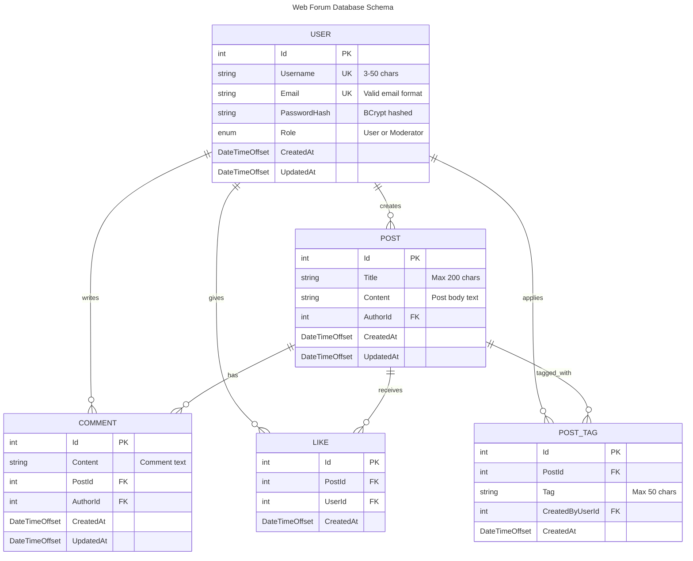

# Web Forum API

A RESTful API backend for a web forum built with ASP.NET Core, Entity Framework Core, and PostgreSQL.

## Features

- **User Authentication**: JWT-based authentication with refresh tokens
- **User Management**: User registration, profile management, and role-based access
- **Posts**: Create and retrieve forum posts with optional tagging
- **Comments**: Comment on posts with threaded discussions
- **Likes**: Like/unlike posts and comments
- **Moderation**: Content moderation with post tagging and management
- **Interactive Documentation**: Scalar UI for API exploration
- **Database Seeding**: Comprehensive test data generation for development and testing

## Tech Stack

- **Backend**: ASP.NET Core (.NET 9)
- **Database**: PostgreSQL 15
- **ORM**: Entity Framework Core
- **Authentication**: JWT Bearer tokens with BCrypt password hashing
- **Documentation**: OpenAPI/Swagger with Scalar UI
- **Containerization**: Docker & Docker Compose
- **Validation**: FluentValidation
- **Testing**: xUnit (Unit & Integration tests)
- **CI/CD**: GitHub Actions with automated testing and coverage reports

## Quick Start

### Prerequisites

- [.NET 9 SDK](https://dotnet.microsoft.com/download/dotnet/9.0)
- [Docker & Docker Compose](https://docs.docker.com/get-docker/)

### 1. Clone the Repository

```bash
git clone https://github.com/P7AC1D/WebForum
cd web-forum
```

### 2. Start the Database

#### Windows (PowerShell)
```powershell
.\db.ps1 start
```

#### Linux/macOS (Bash)
```bash
./db.sh start
```

This will:
- Start PostgreSQL and pgAdmin containers
- Wait for the database to be ready
- Automatically create initial migrations if none exist
- Apply all EF Core migrations to the database

### 3. Seed the Database (Recommended)

**⚠️ Important**: Run database seeding before testing the API to have realistic test data.

```powershell
# Windows
.\db.ps1 seed

# Linux/macOS
./db.sh seed
```

This will populate the database with:
- Test users (including admin and moderator accounts)
- Sample posts with various content
- Comments and likes
- Moderation tags for testing

**Seeding Options:**
```powershell
# Custom seeding amounts
.\db.ps1 seed --users 15 --posts 50 --comments 100 --likes 150

# Force overwrite existing data
.\db.ps1 seed --force
```

**Test Credentials (after seeding):**
- **Admin**: admin@webforum.com / password123
- **Moderator**: moderator@webforum.com / password123  
- **User**: testuser@webforum.com / password123

### 4. Run the API

```bash
cd src/WebForum.Api
dotnet run
```

The API will be available at:
- **API**: https://localhost:7121 (or http://localhost:5043)
- **Scalar UI**: https://localhost:7121/scalar/v1 (or http://localhost:5043/scalar/v1)
- **Swagger UI**: https://localhost:7121/swagger (or http://localhost:5043/swagger)

### 5. Test with Postman Collection

A comprehensive Postman collection is included: `WebForum.postman_collection.json`

Import this collection to test all API endpoints with pre-configured requests and test data.

### 6. Access pgAdmin (Optional)

- **URL**: http://localhost:5050
- **Email**: admin@webforum.com
- **Password**: admin123

## Database Management Scripts

Convenient scripts are provided for database operations:

### Commands Available

| Command   | Description |
|-----------|-------------|
| `start`   | Start PostgreSQL and apply migrations |
| `stop`    | Stop all services |
| `restart` | Restart the database |
| `reset`   | Reset database and migrations (⚠️ **deletes all data and migrations**) |
| `migrate` | Apply EF Core migrations (creates initial migration if none exist) |
| `seed`    | Populate database with realistic test data for development |
| `logs`    | Show database logs |
| `connect` | Connect to database via psql |
| `backup`  | Create a database backup |
| `status`  | Show service status |

### Examples

```bash
# Start database with migrations
.\db.ps1 start          # Windows
./db.sh start           # Linux/macOS

# Seed database with test data
.\db.ps1 seed           # Windows
./db.sh seed            # Linux/macOS

# Apply migrations only (auto-creates initial migration if needed)
.\db.ps1 migrate        # Windows
./db.sh migrate         # Linux/macOS

# Reset database (careful!)
.\db.ps1 reset          # Windows
./db.sh reset           # Linux/macOS

# Check status
.\db.ps1 status         # Windows
./db.sh status          # Linux/macOS
```

## ✅ Verified Working Status

This API has been successfully tested and verified:

- ✅ **Database Setup**: PostgreSQL runs in Docker with automatic migration creation
- ✅ **Initial Migration**: Auto-created on first run if no migrations exist
- ✅ **User Registration**: Working with JWT token generation
- ✅ **Authentication**: JWT-based auth with proper token validation
- ✅ **Flexible User Roles**: Supports string and integer role values during registration
- ✅ **API Documentation**: Scalar UI available at `/scalar/v1`
- ✅ **Database Management**: Convenient PowerShell and Bash scripts
- ✅ **Test Data Seeding**: Comprehensive seeding functionality for development
- ✅ **Continuous Integration**: GitHub Actions workflow with automated testing and coverage reports
- ✅ **Postman Collection**: Pre-configured API testing collection

### Quick Test

To verify the setup is working:

1. Start the database: `.\db.ps1 start`
2. Seed test data: `.\db.ps1 seed`
3. Run the API: `cd src/WebForum.Api && dotnet run`
4. Test registration:
   ```bash
   curl -X POST http://localhost:5043/api/auth/register \
        -H "Content-Type: application/json" \
        -d '{"username":"testuser","email":"test@example.com","password":"password123","role":"User"}'
   ```

Expected response: JSON with JWT token and user information.

## API Endpoints

### Authentication
- `POST /api/auth/register` - Register a new user (supports flexible role assignment)
- `POST /api/auth/login` - User login
- `POST /api/auth/refresh` - Refresh JWT token

### Users
- `GET /api/users/{id}` - Get user profile by ID
- `GET /api/users/me` - Get current user profile
- `PUT /api/users/me` - Update current user profile
- `GET /api/users/me/posts` - Get current user's posts

### Posts
- `GET /api/posts` - Get all posts (paginated with comprehensive filtering)
- `GET /api/posts/{id}` - Get specific post
- `POST /api/posts` - Create new post
- `POST /api/posts/{id}/like` - Like a post
- `DELETE /api/posts/{id}/like` - Unlike a post
- `GET /api/posts/{id}/comments` - Get post comments
- `POST /api/posts/{id}/comments` - Create new comment on a post

### Moderation (Moderator only)
- `POST /api/posts/{id}/tags` - Tag a post for moderation
- `DELETE /api/posts/{id}/tags` - Remove tag from post
- `DELETE /api/posts/{id}/tags/{tag}` - Remove specific tag from post
- `GET /api/posts/tagged` - Get all tagged posts (paginated)

For detailed API documentation, visit the Scalar UI at `/scalar/v1` when the API is running.

## Development

### Project Structure

```
├── src/
│   ├── WebForum.Api/           # Main API project
│   │   ├── Controllers/        # API controllers
│   │   ├── Data/              # Database context
│   │   ├── DTOs/              # Data transfer objects  
│   │   ├── Models/            # Entity models
│   │   ├── Services/          # Business logic services
│   │   │   ├── Interfaces/    # Service interfaces
│   │   │   └── Implementations/ # Service implementations
│   │   └── Migrations/        # EF Core migrations
│   └── WebForum.DataSeeder/   # Database seeding utility
├── tests/
│   ├── WebForum.UnitTests/    # Unit tests
│   └── WebForum.IntegrationTests/ # Integration tests
├── docs/                      # Documentation
├── docker-compose.yml         # Docker services
├── db.ps1 / db.sh            # Database management scripts
├── WebForum.postman_collection.json # Postman API collection
└── .github/workflows/ci.yml   # GitHub Actions CI pipeline
```

### Running Tests

```bash
# Run all tests
dotnet test

# Run unit tests only
dotnet test tests/WebForum.UnitTests/

# Run integration tests only
dotnet test tests/WebForum.IntegrationTests/

# Run data seeder manually
dotnet run --project src/WebForum.DataSeeder
```
dotnet test tests/WebForum.IntegrationTests/
```

### Integration Tests Setup

The integration tests require a PostgreSQL database and are designed to work seamlessly in both local development and CI environments.

#### Local Development

For local development, integration tests use your existing Docker Compose database:

1. **Start the local database**:
   ```powershell
   # Windows
   .\db.ps1 start
   
   # Linux/macOS  
   ./db.sh start
   ```

2. **Run integration tests**:
   ```bash
   dotnet test tests/WebForum.IntegrationTests/
   ```

The integration tests will automatically:
- ✅ Connect to your local PostgreSQL instance (`localhost:5432`)
- ✅ Create database schema using EF Core migrations or `EnsureCreated()`
- ✅ Run tests against the local database
- ✅ Clean up data between tests (preserving schema)

#### CI Environment

In CI (GitHub Actions), integration tests automatically:
- ✅ Start a fresh PostgreSQL container using Testcontainers
- ✅ Create isolated database instances for each test run
- ✅ Generate migrations if missing (via `dotnet ef migrations add`)
- ✅ Apply migrations and run tests
- ✅ Clean up containers automatically

#### Environment Detection

The test factory automatically detects the environment:

| Environment | Database Setup | Detection Method |
|-------------|---------------|------------------|
| **Local Development** | Uses existing Docker Compose PostgreSQL | Default behavior |
| **CI/GitHub Actions** | Uses Testcontainers with fresh PostgreSQL | `CI=true` or `GITHUB_ACTIONS=true` |
| **Force Testcontainers** | Uses Testcontainers locally | Set `USE_TESTCONTAINERS=true` |

#### Troubleshooting Integration Tests

**Local tests failing?**
1. Ensure PostgreSQL is running: `.\db.ps1 status`
2. Check database connectivity: `.\db.ps1 connect`
3. Verify migrations are applied: `.\db.ps1 migrate`

**Need fresh database?**
```powershell
.\db.ps1 reset  # ⚠️ Deletes all data and migrations
.\db.ps1 start  # Recreates with fresh schema
```

**Force Testcontainers locally** (for testing CI behavior):
```bash
$env:USE_TESTCONTAINERS="true"  # PowerShell
# or
export USE_TESTCONTAINERS=true  # Bash

dotnet test tests/WebForum.IntegrationTests/
```

### Entity Framework Migrations

The project includes automatic migration management. When you run `.\db.ps1 migrate` or `.\db.ps1 start`, the scripts will:

1. **Auto-detect**: Check if any migrations exist
2. **Auto-create**: Create an "InitialCreate" migration if none exist
3. **Auto-apply**: Apply all pending migrations to the database

Manual migration commands (if needed):

```bash
cd src/WebForum.Api

# Create new migration (only needed for schema changes)
dotnet ef migrations add MigrationName

# Apply migrations manually
dotnet ef database update

# Remove last migration (if not applied)
dotnet ef migrations remove

# List all migrations
dotnet ef migrations list
```

## Architecture

This project follows **SOLID principles** with:

- **Controllers**: Handle HTTP requests/responses, minimal logic
- **Services**: Contain business logic, implement interfaces
- **Models**: Entity definitions and DTOs
- **Repository Pattern**: Via Entity Framework Core DbContext
- **Dependency Injection**: For loose coupling and testability

### Key Design Decisions

1. **Strict RESTful API**: No edit/delete for posts and comments (forum best practice)
2. **JWT Authentication**: Stateless authentication with refresh tokens
3. **Service Layer**: Clean separation of concerns from controllers
4. **Validation**: FluentValidation for robust input validation
5. **Error Handling**: Consistent error responses across the API
6. **Security**: BCrypt password hashing, JWT token security
7. **Automatic Migrations**: Database schema automatically managed on startup
8. **Flexible Enums**: Support for both string and integer enum values in JSON

## Configuration

### Database Connection

The database connection string is configured in `appsettings.json`:

```json
{
  "ConnectionStrings": {
    "DefaultConnection": "Host=localhost;Port=5432;Database=webforum;Username=postgres;Password=password"
  }
}
```

### JWT Settings

JWT configuration in `appsettings.json`:

```json
{
  "Jwt": {
    "SecretKey": "your-secret-key-here",
    "Issuer": "WebForum.Api",
    "Audience": "WebForum.Client",
    "ExpiryMinutes": 60,
    "RefreshTokenExpiryDays": 7
  }
}
```

## Database Schema

The forum system consists of five main entities:
- **Users**: System users with different roles (User, Moderator)
- **Posts**: Main content created by users
- **Comments**: Responses to posts
- **Likes**: User likes on posts (one per user per post)
- **PostTags**: Tags applied to posts (primarily for moderation)



### Database Business Rules

1. **User Authentication**: Users must be authenticated to post, comment, or like
2. **Like Constraints**: 
   - Each user can only like a post once
   - Users cannot like their own posts
3. **Role-Based Access**:
   - Regular users: Can post, comment, and like
   - Moderators: All regular user capabilities + can tag posts
4. **Post Tags**: Used primarily for moderation (e.g., "misleading-information", "false-information")
5. **No Deletion Policy**: Posts and comments cannot be deleted (ethical reasons per requirements)
6. **Anonymous Reading**: Posts can be viewed without authentication

## CI/CD & Testing

### GitHub Actions Workflow

The repository includes a comprehensive CI/CD pipeline that automatically:

- ✅ **Builds** the solution with .NET 9
- ✅ **Generates migrations** if missing during CI
- ✅ **Runs unit tests** with code coverage
- ✅ **Runs integration tests** with isolated test databases
- ✅ **Generates coverage reports** with detailed metrics
- ✅ **Uploads artifacts** for coverage analysis
- ✅ **Provides coverage summaries** in pull requests

### Coverage Reports

The CI pipeline generates comprehensive coverage reports including:
- Line coverage percentages
- Branch coverage analysis
- Class-level coverage breakdown
- HTML reports with detailed analysis
- Badge generation for repository status

Coverage reports are automatically uploaded as artifacts and can be downloaded from the Actions tab.