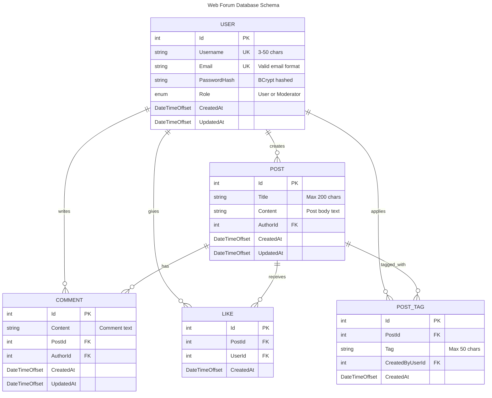

# Web Forum Database ERD

This Entity Relationship Diagram represents the database schema for the web forum application.

## Overview

The forum system consists of five main entities:
- **Users**: System users with different roles (User, Moderator)
- **Posts**: Main content created by users
- **Comments**: Responses to posts
- **Likes**: User likes on posts (one per user per post)
- **PostTags**: Tags applied to posts (primarily for moderation)

## Database Schema

## Relationship Details

### User Relationships
- **User to Post**: One-to-Many (A user can create multiple posts)
- **User to Comment**: One-to-Many (A user can write multiple comments)
- **User to Like**: One-to-Many (A user can like multiple posts, but only once per post)
- **User to PostTag**: One-to-Many (A moderator can apply multiple tags)

### Post Relationships
- **Post to Comment**: One-to-Many (A post can have multiple comments)
- **Post to Like**: One-to-Many (A post can receive multiple likes)
- **Post to PostTag**: One-to-Many (A post can have multiple tags)

## Business Rules

1. **User Authentication**: Users must be authenticated to post, comment, or like
2. **Like Constraints**: 
   - Each user can only like a post once
   - Users cannot like their own posts
3. **Role-Based Access**:
   - Regular users: Can post, comment, and like
   - Moderators: All regular user capabilities + can tag posts
4. **Post Tags**: Used primarily for moderation (e.g., "misleading-information", "false-information")
5. **No Deletion Policy**: Posts and comments cannot be deleted (ethical reasons per requirements)
6. **Anonymous Reading**: Posts can be viewed without authentication

## Indexes Recommendations

For optimal performance, consider these indexes:
- `Posts`: Index on `AuthorId`, `CreatedAt`
- `Comments`: Index on `PostId`, `AuthorId`, `CreatedAt`
- `Likes`: Composite unique index on `(PostId, UserId)`
- `PostTags`: Index on `PostId`, `Tag`
- `Users`: Unique indexes on `Username` and `Email`

## Data Constraints

- **Users**: Username (3-50 chars), Valid email format
- **Posts**: Title max 200 characters
- **PostTags**: Tag max 50 characters
- **Timestamps**: All entities include CreatedAt, Posts/Users include UpdatedAt
